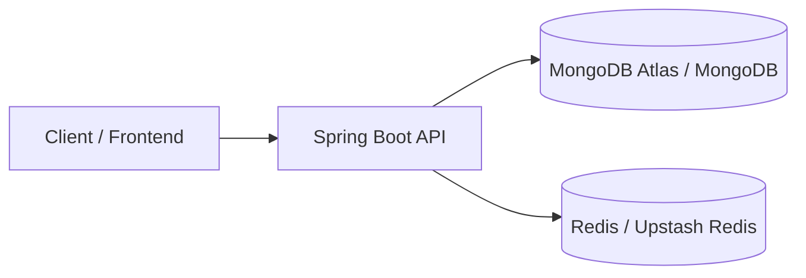

# Distributed Transaction Alert System

Spring Boot 3 service for ingesting transactions, generating alerts, caching recent alerts in Redis, and persisting data in MongoDB.

## Overview

This project is a backend alerting service designed to detect high-value transactions and expose alert management endpoints.

### Core capabilities

- Ingest a batch of transactions asynchronously
- Generate alerts based on transaction amount thresholds
- Persist alerts in MongoDB
- Cache alerts in Redis with a 1-hour TTL
- Retrieve alerts by ID, account, severity, and unresolved state
- Resolve alerts via a REST API

## Architecture



## Tech Stack

- Java 17
- Spring Boot 3.1.x
- Spring Web
- Spring Data MongoDB
- Spring Data Redis
- JUnit 5 + Mockito
- Docker + Docker Compose

## Project Structure

```text
src/
├── main/
│   ├── java/com/alertsystem/
│   │   ├── config/
│   │   ├── controller/
│   │   ├── model/
│   │   ├── repository/
│   │   └── service/
│   └── resources/application.yml
└── test/
    └── java/com/alertsystem/
        └── service/
```

## Prerequisites

- Java 17
- Gradle 9+ installed locally, or a Gradle wrapper if you add one
- MongoDB running on `localhost:27017`
- Redis running on `localhost:6379`

## Configuration

Default local configuration lives in `src/main/resources/application.yml`:

```yaml
spring:
  data:
    mongodb:
      uri: mongodb://localhost:27017/alertsystem
  redis:
    host: localhost
    port: 6379

server:
  port: 8080
```

For deployment, override these values with environment variables.

## Running Locally

### 1. Start dependencies

Use Docker Compose to start MongoDB and Redis:

```bash
docker compose up -d mongodb redis
```

### 2. Run the application

```bash
gradle bootRun
```

### 3. Run tests

```bash
gradle test
```

## Docker

Build the app image:

```bash
gradle bootJar
docker build -t distributed-transaction-alert-system:latest .
```

Run the full stack:

```bash
docker compose up --build
```

## API Endpoints

Base path: `/api/alerts`

### Get all alerts

```http
GET /api/alerts
```

### Get alert by ID

```http
GET /api/alerts/{id}
```

### Get alerts by account

```http
GET /api/alerts/account/{accountId}
```

### Ingest transactions

```http
POST /api/alerts/ingest
Content-Type: application/json
```

Example body:

```json
[
  {
    "id": "tx-1",
    "accountId": "acct-1001",
    "amount": 12500,
    "type": "DEBIT",
    "status": "PENDING",
    "timestamp": "2026-05-25T10:00:00"
  }
]
```

### Resolve an alert

```http
PATCH /api/alerts/{id}/resolve
```

## Alert Rules

- `amount > 10000` -> `HIGH`
- `amount > 5000` -> `MEDIUM`
- otherwise -> `LOW`

## Redis Cache Behavior

- Key format: `alert:{id}`
- Value: serialized JSON alert payload
- TTL: 1 hour
- Recent alerts are read using the `alert:*` key pattern

## Deployment Guide

### Recommended stack

- Frontend: Vercel
- Backend: Render
- MongoDB: MongoDB Atlas
- Redis: Upstash Redis

### Environment variables

Set these values in your deployment platform:

```bash
SPRING_DATA_MONGODB_URI=mongodb+srv://<user>:<password>@<cluster>/alertsystem
SPRING_REDIS_HOST=<upstash-host>
SPRING_REDIS_PORT=6379
```

If your Redis provider requires authentication, add the password or URL-based connection string supported by Spring Data Redis.

### Render deployment

1. Connect the repository.
2. Choose Docker deployment.
3. Set the environment variables above.
4. Expose port `8080`.

### Vercel frontend integration

Point the frontend API base URL to the Render backend URL and enable CORS on the backend for the Vercel domain.

## Testing

The project includes JUnit 5 and Mockito-based tests for the service layer.

If you want code coverage reports, add a JaCoCo plugin and run:

```bash
gradle test jacocoTestReport
```

## Notes

- The project currently uses Spring Boot 3.1.0 and Java 17.
- MongoDB and Redis are expected to be available before running the service.
- If you add a Gradle wrapper, prefer it in CI and local development for reproducible builds.
